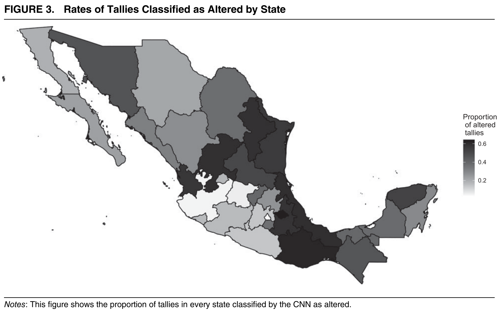

## Why we analyze data

- **Goal:** understand the *systematic* relationship between an outcome (dependent variable) and predictors (independent variables)
- We want to know the function $f$ in $Y = f(X) + \epsilon$
    + $f$ is the unknown form with which $X$ provides systematic information about $Y$

## Why we analyze data
```{r function, out.width = '100%', echo=FALSE, fig.cap="", fig.show="hold"}

```

## Difference between "traditional" statistics and ML
- Goal
  + **TS:** test hypotheses, make inferences about population parameters
  + **ML:** build predictive models for new data
- Approach 
  + **TS:** pre-defined assumptions about the population distribution; these assumptions, in turn, inform model selection
  + **ML:** no assumptions about distribution or functional form; models learn patterns and relationships from the data
- Data
  + **TS:** good for smaller datasets that are a representative sample of a larger population
  + **ML:** good for larger and more complex data sets, also unstructured data (images, text, audio)

## Difference between "traditional" statistics and ML
- Interpretability
  + **TS:** a set of pre-defined assumptions allows for higher interpretability; results are easier to understand
  + **ML:** can be "black boxes", models can be difficult to interpret
- Training
  + **TS:** usually no split between training and test data: the analysis is done on one full dataset
  + **ML:** the dataset is split into training, (cross-)validation, and test set to prevent overfitting of models to idiosyncratic features of the data 

## When ML makes sense

- Large data sets (number of observations)
- Large number of predictors and/or no theory about $f$
- Accurate predictions are more valuable than causal inference
- Complex non-linearity in the data 
- Unstructured data 
- Goal is feature generation (making new variables)

## Types of ML 

- **Classification (categorical outcome)**
  + Naive Bayes
  + Clustering algorithms (kNN)
  + Logistic regression
  + Random forest
  + Gradient boosting machine
  + Support vector machine
  + Neural networks     

- **Regression (continuous outcome)**
  + Lasso, ridge, and linear regression
  + Random forest
  + Gradient boosting machine
  + Support vector machine
  + Neural networks
  
## Types of ML 

- **Supervised learning:** the computer is trained on a labeled dataset and learns to make predictions or classifications based on new data
- **Unsupervised learning:** the computer is given an unlabeled dataset and is tasked with finding patterns or relationships within the data
- **Reinforcement learning:** the computer learns to make decisions based on a reward signal, which is provided when it performs an action that leads to a positive outcome

## Supervised learning

```{r cantu0, out.width = '90%', echo=FALSE, fig.cap="", fig.show="hold"}

```

## Supervised learning

```{r cantu1, out.width = '100%', echo=FALSE, fig.cap="", fig.show="hold"}

```

## Supervised learning

```{r cantu2, out.width = '100%', echo=FALSE, fig.cap="", fig.show="hold"}

```

## Unsupervised learning
```{r bagozzi0, out.width = '90%', echo=FALSE, fig.cap="", fig.show="hold"}

```

## Unsupervised learning
```{r bagozzi1, out.width = '100%', echo=FALSE, fig.cap="", fig.show="hold"}

```

## Unsupervised learning
```{r bagozzi2, out.width = '100%', echo=FALSE, fig.cap="", fig.show="hold"}

```

# In more detail: tree-based ML

## A decision tree

- **Goal:** split covariate space into regions, with each region corresponding to a unique covariate combination
	+ The model then makes one prediction for all observations within this region

```{r space, out.width = '40%', echo=FALSE, fig.cap="", fig.show="hold"}


```

## In theory, regions could have any shape

But it is computationally infeasible to consider every possible partition (left), which is why the model works with high-dimensional rectangles (right). This is called *recursive binary splitting*

```{r shape, out.width = '90%', echo=FALSE, fig.cap="", fig.show="hold"}

```

## For example, the salary of baseball players

This is a *regression* tree: the outcome is quantitative

```{r baseball, out.width = '48%', echo=FALSE, fig.cap="", fig.show="hold"}

knitr::include_graphics("figures/tree2.png")
```

## Another example: legit emails vs. spam

This is a *classification* tree: the outcome is categorical/qualitative

```{r spam, out.width = '55%', echo=FALSE, fig.cap="", fig.show="hold"}

```

## Random forests

- **Why forests?** Because one tree can be sensitive to data changes
- **Why random?** Because each binary split only considers a random sample of predictors
	+ If there is a very strong predictor in the dataset, we don't want *all* trees to use this predictor in the first split
- The model then aggregates the results based on the predictions of most trees


## Things you can explain with tree-based models

- Civil war onset (Muchlinski et al 2016)
- Supreme Court rulings (Kaufman, Kraft and Sen 2019)
- Women’s legislative representation and the allocation of government expenditures (Funk, Paul and Philips 2022)
- Negative campaigning and voting (Montgomery and Olivella 2016)
- Democracy (Weitzel et al 2023a) and democratic backsliding (Weitzel et al 2023b)
- Variation in GDP data reported across different sources (Goes 2023)

## Advantages of tree-based models

- No need to develop theoretical expectations
- No need to make assumptions about...
	+ predictor variables
	+ functional form of predictors (linear, log, squared)
- More honesty about the lack of causality
	+ Regressions are not causal either, but people often interpret them causally

## ML steps

1. Data cleaning and preparation
  + Missing values, feature engineering (one-hot encoding, ranging, standardizing)
2. Choose a model and train it
  + Select appropriate ML algorithm 
  + Split the data into training, (cross-)validation, and testing sets to evaluate the model's performance
  + Train the algorithm on the prepared training set
  + Be aware of *data leakage*
3. Evaluate the model
  + Evaluate the model's performance on the (cross-)validation set
  + Fine-tune it as necessary to improve accuracy


# An applied example

## Predicting Democracy scores

- Are democracy scores subjective or objective?
- Idea: Use a democracy score (liberal democracy) as the outcome variable and train it on a model with purely objective indicators.
- Predict democracy scores based on this model and compare to observed democracy scores.

## The code
- Entire code available on Github.
- We use the V-Dem package to load V-Dem 13.
- Pre-processing steps involve cleaning the data, transforming variables, visualizations of the data.
```{r code, echo=TRUE, eval = FALSE }
## Libraries
devtools::install_github("vdeminstitute/vdemdata", 
                         force = TRUE)

library("tidyverse") # For data processing
library("vdemdata")  # The data set we will use
library("h2o")       # the machine learning package 
library("randomizr") # for grouped fold assignment
library("naniar")    # Missing data visualization
```

## Train set

- We reduce the data set to the id, outcome, and predictor variables.
- We also remove all rows in which the outcome (Liberal Democracy) is missing.
- We reduce the training set to years before 2012.

```{r train, echo=TRUE, eval = FALSE }
df_vdem_train <- 
  df_vdem |>
  ungroup() |>
  dplyr::select(all_of(ids), 
                all_of(preds), 
                all_of(outcome)) |>
  drop_na(all_of(outcome)) |>
  dplyr::filter(year <= 2011) 
```

## Cross-validation set

- We add cross-validation folds to the training data.
- There are six equally sized folds. 
- Stratification is based on country.
- This allows us to train the model and validate it on data that it has never learned about.

```{r cross, echo=TRUE, eval = FALSE }
df_vdem_train$folds <- cluster_ra(
  clusters = df_vdem_train$country_id, 
  conditions = c("Fold_1", "Fold_2", 
                 "Fold_3", "Fold_4", 
                 "Fold_5", "Fold_6")) 
```
## Test set

- We generate a test set that we use to assess the quality of our model.
- This is data that never was part of the training process. The model does not know it.
- Our test set are all years after 2011. 

```{r test, echo=TRUE, eval = FALSE }
df_vdem_predict <- 
  df_vdem |>
  ungroup() |>
  filter(year > 2011) |> 
  dplyr::select(all_of(ids), 
                all_of(preds), 
                all_of(outcome))
```

## H2O Config

- We use H2O for the random forest
- Configuration uses n-1 cores and 20GB of RAM 
- H20 works in R, Python, and Flow. 
- Other packages also great!

```{r config, echo=TRUE, eval = FALSE }
# Initialization
h2o.no_progress()
h2o.init(nthreads=-1, max_mem_size = "20g")
h2o.removeAll()

# H20 data objects
train_h2o  <- as.h2o(df_vdem_train)
test_h2o   <- as.h2o(df_vdem_predict)
```

## Estimating the model
```{r est, echo=TRUE, eval = FALSE }
model_rf <- 
  h2o.randomForest(
    model_id = "ld_1",
    x = predictors, 
    y = outcome,
    fold_column = "folds",
    training_frame = train_h2o, 
    ntrees = 400,
    mtries = 4,
    col_sample_rate_per_tree = 0.8,
    seed = 1904,                 
    keep_cross_validation_predictions = TRUE)
```

## Goodness of fit
- After estimation we can look at the performance metrics in the training and cross-validation data set.
- Common are R2 and Mean Squared Error.

```{r r2mse, echo=TRUE, eval = FALSE }
> h2o.r2(model_rf_libdem, train = TRUE, xval = TRUE)
    train      xval 
0.9539659 0.7451879 
> h2o.performance(model_rf_libdem, train = TRUE)
H2ORegressionMetrics: drf
** Reported on training data. **
** Metrics reported on Out-Of-Bag training samples **

MSE:  0.002712985
RMSE:  0.05208633
MAE:  0.03132654
RMSLE:  0.04023765
Mean Residual Deviance :  0.002712985
```

## What matters
- Variable Importance Plots show us the scaled importance of individual predictors for the random forest.

```{r vip, out.width = '100%', echo=FALSE, fig.cap="", fig.show="hold"}
knitr::include_graphics("figures/vip.png")
```

## The predictions 
```{r prediction, out.width = '100%', echo=FALSE, fig.cap="", fig.show="hold"}

```

## The predictions 
```{r prediction2, out.width = '100%', echo=FALSE, fig.cap="", fig.show="hold"}

```

## Why is the performance so poor?

- Statistical reasons:
  + More feature engineering necessary!
  + More model tuning is necessary, we have not adjusted any of the hyperparameters of the random forest.
- Theoretical reasons:
  + Our outcome is liberal democracy and all our predictors are indicators of an electoral democracy. 

    
# Additional Resources

## Books, packages, and articles
- [Introduction to Statistical Learning](https://trevorhastie.github.io/ISLR/), great introduction 
- [Elements of Statistical Learning](https://hastie.su.domains/ElemStatLearn/), more advanced
- [List of R packages for Machine Learning](https://cran.r-project.org/web/views/MachineLearning.html), CRAN Task View List 
- [Machine Learning Methods That Economists Should Know About](https://www.annualreviews.org/doi/abs/10.1146/annurev-economics-080217-053433), academic article with an overview